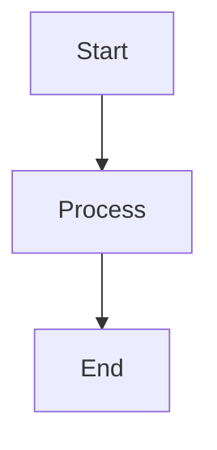

# QuizMaster Documentation

This directory contains the complete documentation for QuizMaster, built with [Docusaurus](https://docusaurus.io/).

## 🚀 Quick Start

### Development

Start the documentation site locally:

```bash
npm start
```

The site will open at [http://localhost:3000](http://localhost:3000).

### Build

Build the documentation for production:

```bash
npm run build
```

The static files will be generated in the `build/` directory.

### Serve Production Build

Preview the production build locally:

```bash
npm run serve
```

## 📁 Structure

```
docs/
├── docs/                      # Documentation content (Markdown)
│   ├── intro.md              # Introduction page
│   ├── getting-started/      # Getting started guides
│   ├── user-guide/           # User documentation
│   ├── developer-guide/      # Developer documentation
│   ├── api/                  # API reference
│   ├── deployment/           # Deployment guides
│   └── contributing/         # Contributing guidelines
├── blog/                      # Blog posts (optional)
├── src/                       # Custom React components
├── static/                    # Static assets (images, etc.)
├── docusaurus.config.ts       # Main configuration
├── sidebars.ts                # Sidebar navigation
└── package.json               # Dependencies
```

## ✍️ Adding New Documentation

### 1. Create a New Page

Create a new `.md` file in the appropriate directory:

```bash
# Example: Add a new user guide page
touch docs/user-guide/my-new-page.md
```

### 2. Add Frontmatter

Add frontmatter to your new page:

```markdown
---
sidebar_position: 2
title: My New Page
---

# My New Page

Your content here...
```

### 3. Update Sidebar (if needed)

The sidebar is configured in `sidebars.ts`. Add your new page to the appropriate section:

```typescript
{
  type: 'category',
  label: 'User Guide',
  items: [
    'user-guide/authentication',
    'user-guide/my-new-page',  // Add here
  ],
}
```

### 4. Test Locally

```bash
npm start
```

Navigate to your new page and verify it appears correctly.

## 📝 Writing Guidelines

### Use Markdown Features

- **Headers**: Use `#` for headers (H1, H2, H3, etc.)
- **Code Blocks**: Use triple backticks with language specification
- **Links**: Use `[text](url)` for links
- **Images**: Use `` for images

### Admonitions

Use admonitions to highlight important information:

```markdown
:::tip
This is a helpful tip!
:::

:::warning
This is a warning!
:::

:::info
This is informational.
:::

:::danger
This is dangerous!
:::
```

### Code Examples

Always specify the language for syntax highlighting:

````markdown
```javascript
const example = 'code';
```

```bash
npm install
```
````

### Mermaid Diagrams

Use Mermaid for diagrams:

````markdown

````

## 🎨 Customization

### Theme Configuration

Edit `docusaurus.config.ts` to customize:

- Site title and tagline
- Navbar items
- Footer links
- Color mode (dark/light)
- Prism theme for code highlighting

### Custom CSS

Add custom styles in `src/css/custom.css`.

### Custom Components

Create custom React components in `src/components/` and use them in MDX files.

## 🚢 Deployment

### Vercel (Recommended)

1. Push your changes to GitHub
2. Import the `docs/` directory to Vercel
3. Set build command: `npm run build`
4. Set output directory: `build`
5. Deploy!

### Netlify

1. Connect your GitHub repository
2. Set build command: `npm run build`
3. Set publish directory: `build`
4. Deploy!

### GitHub Pages

```bash
npm run deploy
```

Make sure to configure `organizationName` and `projectName` in `docusaurus.config.ts`.

## 📚 Resources

- [Docusaurus Documentation](https://docusaurus.io/docs)
- [Markdown Guide](https://www.markdownguide.org/)
- [Mermaid Documentation](https://mermaid.js.org/)

## 🤝 Contributing

See the [Contributing Guide](./docs/contributing/contributing.md) for information on how to contribute to the documentation.

## 📄 License

This documentation is part of QuizMaster and is licensed under the MIT License.
