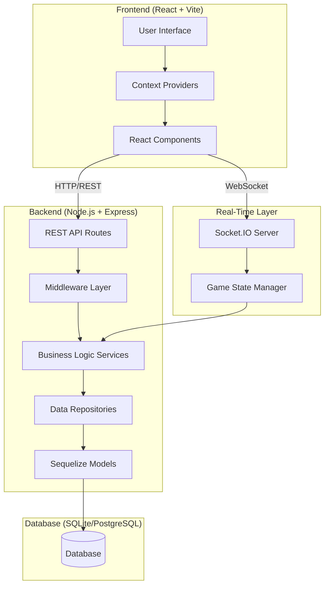
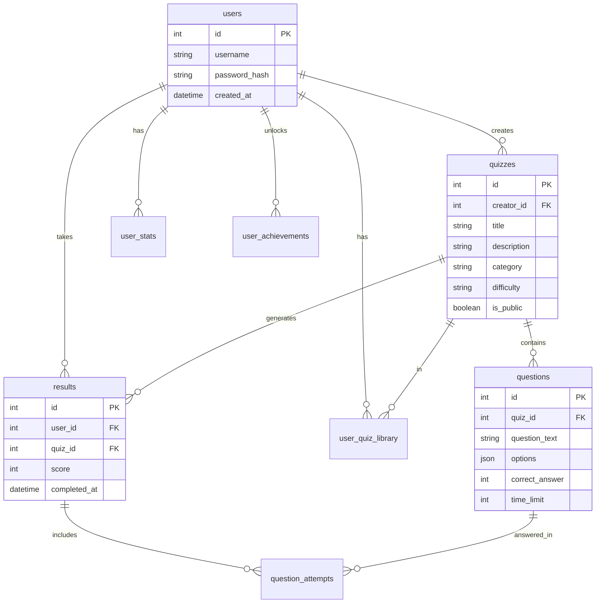
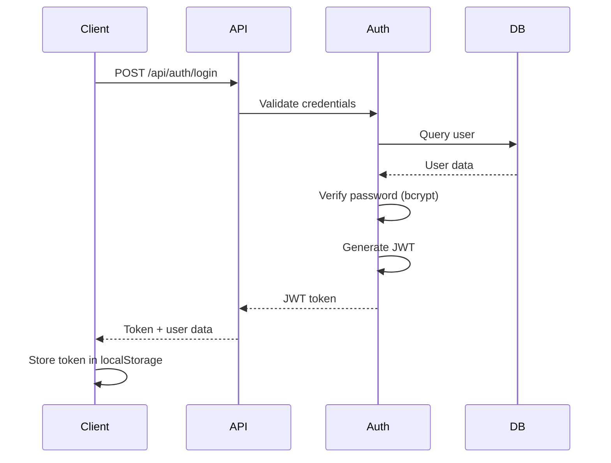
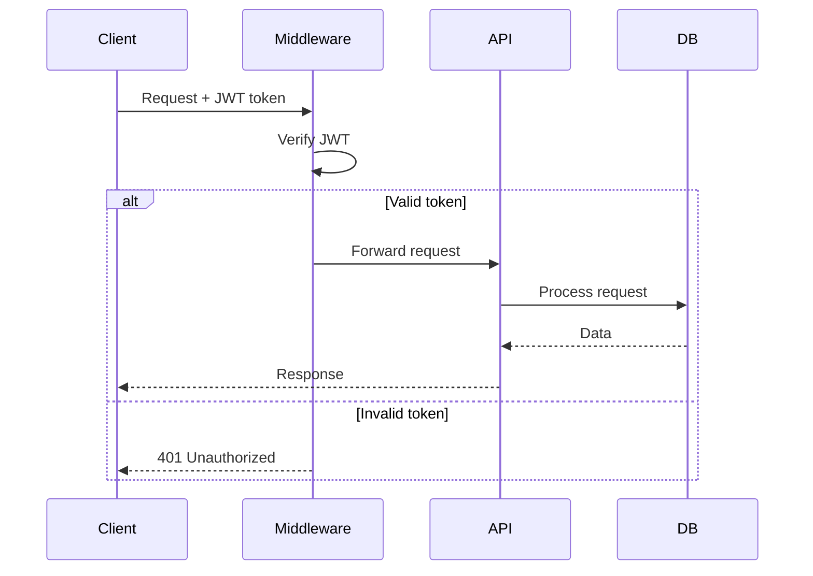

# Architecture Overview

QuizMaster is built with a modern, full-stack architecture using React for the frontend and Node.js/Express for the backend, with real-time capabilities powered by Socket.IO.

## System Architecture



## Technology Stack

### Frontend

| Technology | Version | Purpose |
|------------|---------|---------|
| **React** | 19.2.0 | UI library with hooks |
| **Vite** | 7.2.4 | Build tool and dev server |
| **Socket.IO Client** | 4.8.1 | Real-time communication |
| **Recharts** | 3.5.0 | Data visualization |
| **CSS3** | - | Glassmorphism styling |

### Backend

| Technology | Version | Purpose |
|------------|---------|---------|
| **Node.js** | - | Runtime environment |
| **Express** | 5.1.0 | Web framework |
| **Socket.IO** | 4.8.1 | WebSocket server |
| **Sequelize** | 6.37.7 | ORM for database |
| **SQLite3** | 5.1.7 | Development database |
| **PostgreSQL** | - | Production database |
| **JWT** | - | Authentication |
| **bcrypt** | 6.0.0 | Password hashing |

### Security & Performance

| Technology | Purpose |
|------------|---------|
| **Helmet** | Security headers |
| **Express Rate Limit** | Rate limiting |
| **Compression** | Response compression |
| **Express Validator** | Input validation |
| **xss-clean** | XSS protection |

## Architecture Layers

### 1. Frontend Layer

#### Component Structure

```
client/src/
├── components/           # React components
│   ├── AuthForm.jsx     # Authentication
│   ├── Home.jsx         # Personal library
│   ├── QuizHub.jsx      # Public quizzes
│   ├── QuizGame.jsx     # Quiz gameplay
│   ├── QuizReport.jsx   # Results & analytics
│   └── ...
├── context/             # React context
│   ├── AuthContext.jsx  # Authentication state
│   └── ToastContext.jsx # Toast notifications
├── App.jsx              # Main app component
└── index.css            # Global styles
```

#### State Management

- **Context API**: Used for global state (auth, toasts)
- **Local State**: Component-level state with `useState`
- **Real-time State**: Socket.IO events for live updates

### 2. Backend Layer

#### Layered Architecture

```
server/src/
├── routes/              # API endpoints
├── middleware/          # Express middleware
├── services/            # Business logic
├── repositories/        # Data access layer
├── models/              # Sequelize models
├── managers/            # Game state management
└── utils/               # Utility functions
```

#### Layer Responsibilities

1. **Routes Layer**: HTTP endpoint definitions
2. **Middleware Layer**: Authentication, validation, rate limiting
3. **Services Layer**: Business logic and orchestration
4. **Repository Layer**: Database queries and data access
5. **Models Layer**: Database schema and relationships

### 3. Database Layer

#### Schema Design



### 4. Real-Time Layer

#### Socket.IO Architecture

```javascript
// Game state management
GameManager
├── Active Games Map
├── Player Sessions
└── Real-time Events
    ├── join-quiz
    ├── submit-answer
    ├── quiz-complete
    └── disconnect
```

#### Real-Time Features

- **Live Scoring**: Instant feedback on answers
- **Timer Sync**: Synchronized countdown across clients
- **Game State**: Shared game state management
- **Disconnection Handling**: Graceful handling of disconnects

## Design Patterns

### Repository Pattern

Separates data access logic from business logic:

```javascript
// Repository handles database queries
class QuizRepository {
  async findById(id) {
    return await Quiz.findByPk(id);
  }
}

// Service uses repository for business logic
class QuizService {
  constructor(quizRepository) {
    this.quizRepository = quizRepository;
  }
  
  async getQuizWithQuestions(id) {
    const quiz = await this.quizRepository.findById(id);
    // Additional business logic
    return quiz;
  }
}
```

### Middleware Chain

Express middleware for cross-cutting concerns:

```javascript
app.use(helmet());              // Security headers
app.use(cors());                // CORS handling
app.use(compression());         // Response compression
app.use(rateLimiter);           // Rate limiting
app.use(authMiddleware);        // Authentication
app.use(inputValidator);        // Input validation
```

### Context Provider Pattern

React context for global state:

```javascript
<AuthProvider>
  <ToastProvider>
    <App />
  </ToastProvider>
</AuthProvider>
```

## Data Flow

### Typical Request Flow

1. **Client**: User action triggers API call
2. **Middleware**: Request passes through middleware chain
3. **Route**: Route handler receives request
4. **Service**: Business logic processes request
5. **Repository**: Data access layer queries database
6. **Model**: Sequelize model interacts with database
7. **Response**: Data flows back up the chain to client

### Real-Time Flow

1. **Client**: Emits Socket.IO event
2. **Socket.IO Server**: Receives event
3. **Game Manager**: Updates game state
4. **Broadcast**: Emits events to relevant clients
5. **Client**: Receives and updates UI

## Security Architecture

### Authentication Flow



### Protected Route Flow



## Performance Optimizations

### Caching Strategy

- **In-Memory Cache**: Frequently accessed data (public quizzes, leaderboard)
- **Cache Invalidation**: On data mutations (quiz updates, new results)
- **TTL**: Time-to-live for cached entries

### Database Optimization

- **Indexes**: Strategic indexes on foreign keys and common queries
- **Connection Pooling**: Efficient database connection management
- **Query Optimization**: Optimized queries with proper joins and selects

### Frontend Optimization

- **Code Splitting**: Lazy loading of components
- **Memoization**: React.memo for expensive components
- **Debouncing**: Input debouncing for search/filter
- **Asset Optimization**: Optimized images and fonts

## Scalability Considerations

### Horizontal Scaling

- **Stateless API**: API servers can be scaled horizontally
- **Session Storage**: JWT tokens enable stateless authentication
- **Database**: PostgreSQL for production with replication

### Vertical Scaling

- **Database Optimization**: Indexes, query optimization
- **Caching**: Reduce database load
- **Connection Pooling**: Efficient resource usage

## Next Steps

Explore specific architecture components:

- **[Frontend Architecture](./frontend.md)**: React component structure
- **[Backend Architecture](./backend.md)**: Express server details
- **[Database Schema](./database.md)**: Database design and relationships
